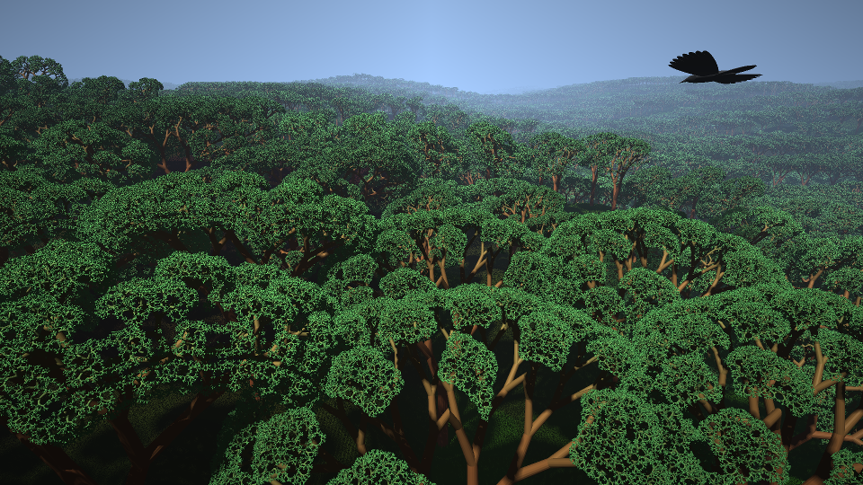

# Eternal forest executable graphic



Raymarched forest written in GLSL and C for Ubuntu. This was my entry in the 4k executable graphics compo for the [Solskogen](https://www.solskogen.no/) 2020 demoparty.

## Build instructions

On Ubuntu, install prerequisites via `apt`:

```bash
$ sudo apt install clang fsharp libgles-dev libgtk-3-dev unifdef xz-utils
```

Then make sure that git submodules are pulled and build it:

```bash
$ git submodule update --init
$ make
```

If there are no errors, the executable should be built as `bin/main-4k`. Note that depending on your graphics card, drivers and resolution, this could be slow to display, and will probably freeze your operating system while running. (NO WARRANTY, EXPRESS OR IMPLIED. YOLO)

## Tools used

* [Clang](https://clang.llvm.org/) compiler
* Libraries: OpenGL and GTK 3
* [Shader Minifier](https://github.com/laurentlb/Shader_Minifier)
* sstrip from [ELFKickers](https://github.com/BR903/ELFkickers)
* [xz](https://tukaani.org/xz/) (and shell scripting) for executable compression
